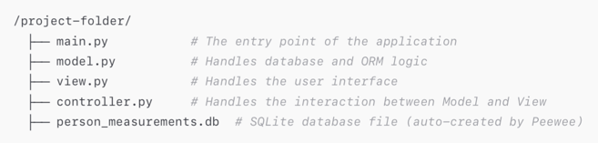
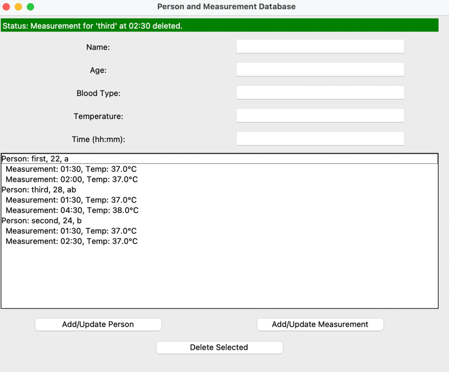

To implement an MVC (Model-View-Controller) structure with Peewee as the ORM and the requirement where:

Model is independent (knows nothing about View or Controller).

View interacts with Model but does not directly modify it only read the data for updating the listbox.

Controller mediates the interactions between Model and View.

