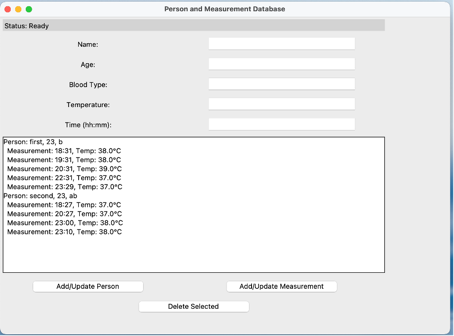
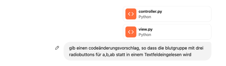
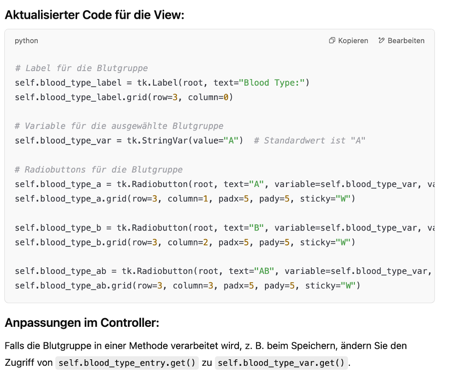
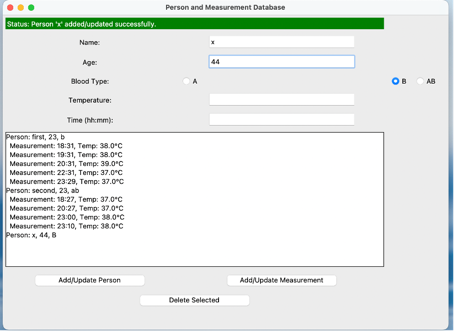
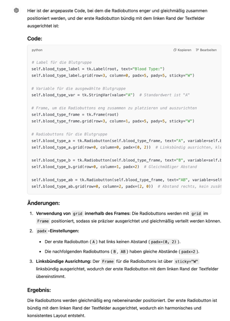
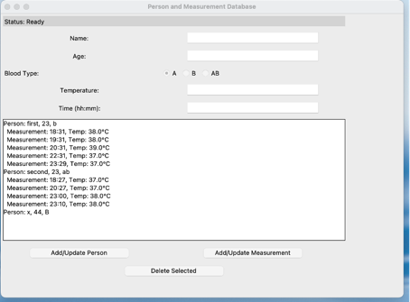
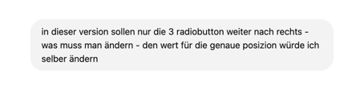
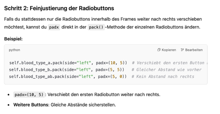
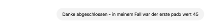

Bisher:

Nun werden Radio-Button eingefügt

Im weiteren wird chatgpt bemüht, um den view anzupassen:

Zeile 91 im VIEW (nicht !!! im CONTROLLER) wie vorgeschlagen anpassen

Zeile 83 ausblenden. (fehlt bei chatgpt)
und
Nun Zeile 26 bis 29 im VIEW ersetzen durch den Codevorschlag

Nun die verteilung der Radiobutton anpassen

