Starten einer Postgres DB im Docker Container:

Zunächst Dockerimage laden:
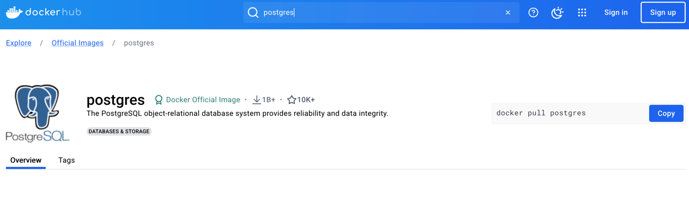

docker pull postgres
im Terminal ausführen

Dann taucht das dockerimage im DockerDesktop auf

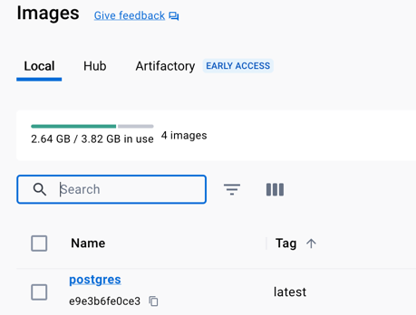

nun das image im container mittels run starten

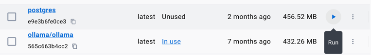

Dabei optionale Settings Ports etc setzen:

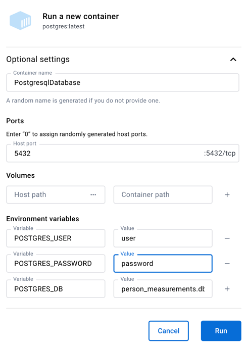

Nun kann man das Python-Program starten und die Eingabe Maske erscheint

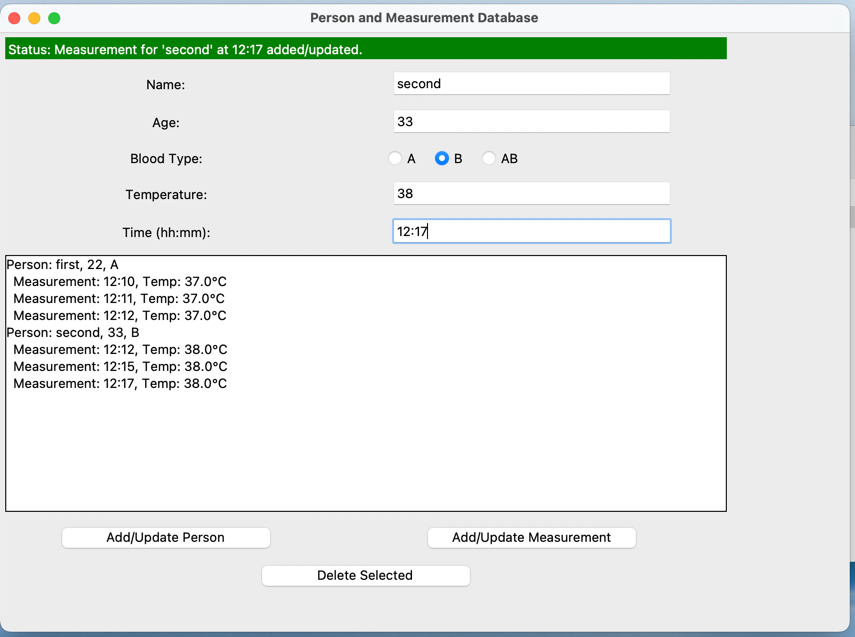

Nun kann man in Pycharm eine DataSource für Postgres einrichten und die Connection testen:

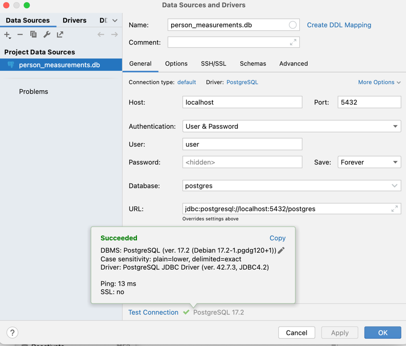

wichtig ist es unter dem "Reiter Schema" All schemas für die betreffende dB auszuwählen:

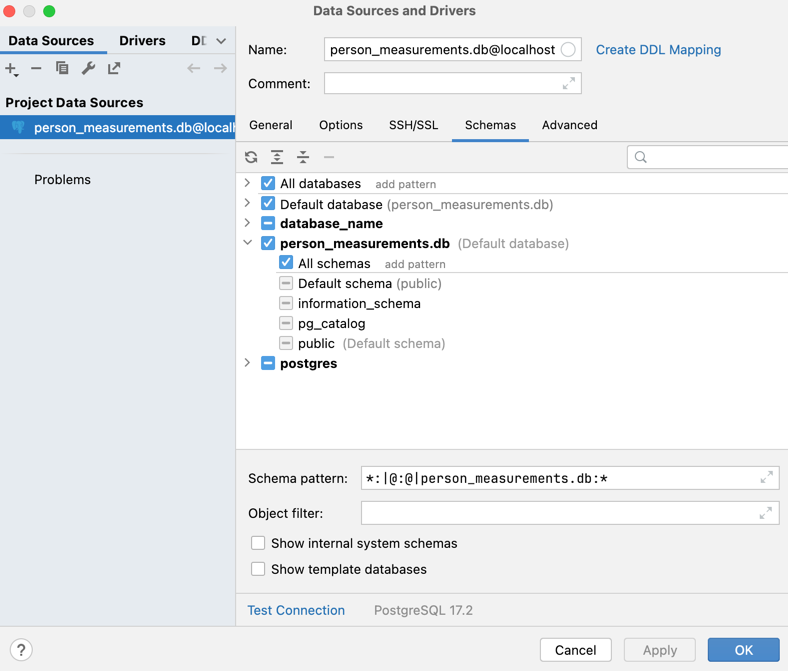

 Mit der rechten Maustaste auf der DB die query-Console auswählen:

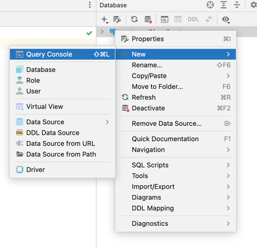

Eingabe  SQL-Command
SELECT * from person;
oder
SELECT * from measurement;
Ausführen über das grüne Dreieck

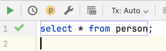

Ergebnis:
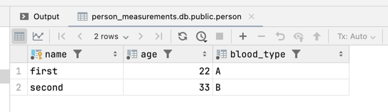

oder 

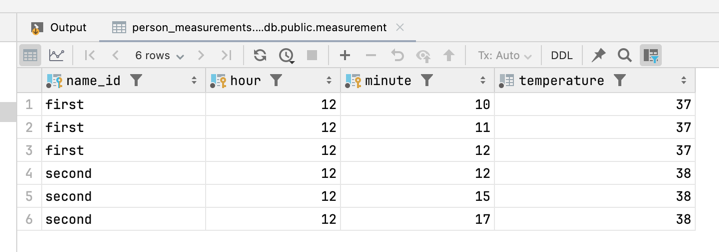

